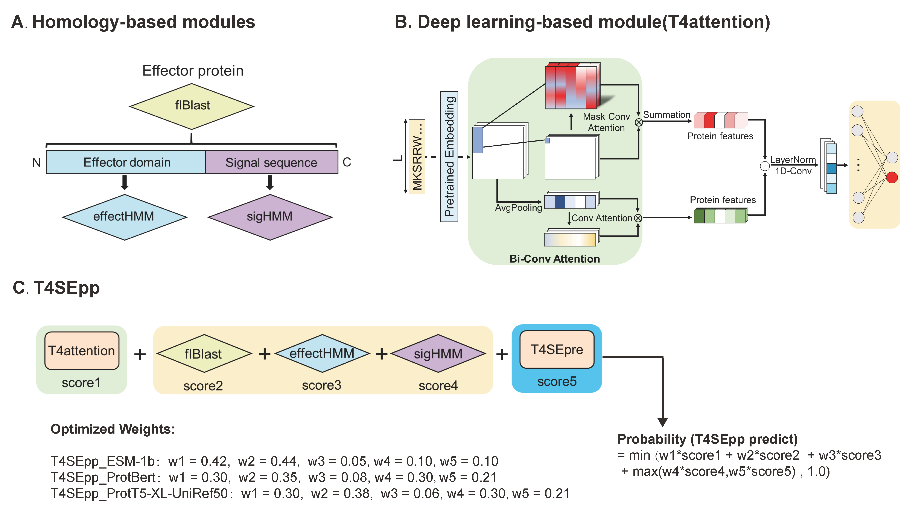

# T4SEpp


Codes and models for the paper "T4SEpp: a pipeline integrating protein language models to predict bacterial type IV secreted effectors".
> T4SEpp: a pipeline integrating protein language models to predict bacterial type IV secreted effectors \
> Authors: Yueming Hu,Yejun Wang, Xiaotian Hu, Haoyu Chao, Sida Li, Qinyang Ni, Yanyan Zhu, Yixue Hu, Ziyi Zhao,  Ming Chen. 

[T4SEpp Website](https://bis.zju.edu.cn/T4SEpp)

Pytorch implementation of T4SEpp, an Integrated Prediction Pipeline for bacterial type IV secretion system effectors (T4SEs) using pre-trained model. It applies six protein pre-trained language models (pLMs) including ESM-1b (provided by [esm repository](https://github.com/facebookresearch/esm)) or other pLMs (provided by [ProtTrans repository](https://github.com/agemagician/ProtTrans)) to the prediction task and achieves high testing accuracy(**97.6%**). It also provides genome-scale prediction for T4SEs.

![Workflow]<div align="center"></div>

## Set up

The standalone version of T4SEpp has been tested in Linux.

Before using the T4SEpp, please ensure that Python has been installed in your server. 
Please check the `requirements.txt` file for more details on required Python packages. You can create new environment and install all required packages with:

```shell
pip install -r requirements.txt
conda install -c bioconda diamond
conda install -c bioconda hmmer
```

## Using T4SEpp

T4SEpp can predict T4SEs from protein sequences in the FASTA format.
```shell
python T4SEpp.py \
   -i={} \                    # Protein fasta sequence file to be predicted
   -m={} \                    # please choose testing model name(ESM-1b, ProtBert or ProtT5-XL-UniRef50)
   -b={} \                    # python bin folder
   -d={} \                    # diamond bin folder
   -s={} \                    # hmmsearch bin folder
   -p={} \                    # Feature extraction script and model folder
   -g={} \                    # Choose any cuda or cpu for prediction
```

The prediction results can be found in `results/`, including homology and deep learning modules, generating predicted probabilities by putative T4SEs from model linear weights.

Besides the most recommended model `T4SEpp_ProtBert`, T4SEpp provides another three approaches in T4SEs prediction, which integrated signal sequence features, effector domain features, full-length sequence homology features and pLMs embedding features into a complete prediction pipeline.
 -  `T4SEpp_ESM-1b`: based on sequence homology features, protein pre-trained language models (ESM-1b) and Bi-conv attention.
 -  `T4SEpp_ProtBert`: based on sequence homology features, protein pre-trained language models (ProtBert) and Bi-conv attention.
 -  `T4SEpp_ProtT5-XL-UniRef50`: based on sequence homology features, protein pre-trained language models (ProtT5-XL-UniRef50) and Bi-conv attention.


## Testing Result

We have compared T4SEpp with existing prediction tools according to the perfomance on an independent test set(20 T4SEs + 150 none-T4SEs). 

|           Method          |  ACC  |  SN   |  SP   |  PR   |  F1   |  MCC  |  AUC  | AUPRC |
| :-----------------------: | :---: | :---: | :---: | :---: | :---: | :---: | :---: | :---: |
|       T4SEpre_psAac       | 0.888 | 0.700 | 0.913 | 0.519 | 0.596 | 0.541 | 0.921 | 0.740 |
|       T4SEpre_bpbAac      | 0.829 | 0.700 | 0.847 | 0.378 | 0.491 | 0.427 | 0.895 | 0.730 |
|          CNNT4SE          | 0.953 | 0.700 | 0.987 | 0.875 | 0.778 | 0.758 | 0.943 | 0.860 |
|         Bastion4          | 0.965 | 0.900 | 0.973 | 0.818 | 0.857 | 0.838 |   -   |   -   |
|    T4SEfinder-pssm_cnn    | 0.906 | 0.800 | 0.920 | 0.571 | 0.667 | 0.625 | 0.923 | 0.759 |
|  T4SEfinder-hybridbilstm  | 0.941 | 0.800 | 0.960 | 0.727 | 0.762 | 0.730 | 0.945 | 0.852 |
|  T4SEfinder-TAPEBert_MLP  | 0.958 | 0.850 | 0.973 | 0.810 | 0.829 | 0.806 | 0.959 | 0.805 |
|       T4SEpp_ESM-1b       | 0.976 | 0.850 | 0.993 | 0.944 | 0.894 | 0.883 | 0.953 | 0.928 |
|      T4SEpp_ProtBert      | 0.982 | 0.900 | 0.993 | 0.947 | 0.923 | 0.913 | 0.965 | 0.950 |
| T4SEpp_ProtT5-XL-UniRef50 | 0.988 | 0.900 | 1.000 | 1.000 | 0.947 | 0.942 | 0.963 | 0.932 |

Apart from the considerable prediction accuracy, T4SEpp shows a major advantage in computational efficiency due to the adoptation of protein pre-trained langugae model.

## Contact

If you any questions, please contact Yueming Hu at huym@zju.edu.cn.

